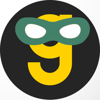

# Sidekick

Sidekick is a [sidecar](https://learn.microsoft.com/en-us/azure/architecture/patterns/sidecar) proxy process that allows your applications to talk with a Bolt cluster through any AWS or GCS SDK.

## Getting started

- go1.20
- A bolt cluster
- A cloud instance that has a vpc connection with the bolt cluster

## Running Sidekick

### Env Variables

In order to run Sidekick, you first need to set some ENV variables

```bash
export GRANICA_CUSTOM_DOMAIN=<YOUR_CUSTOM_DOMAIN>
# Optional of running on an ec2 or google compute engine instance
export GRANICA_REGION=<YOUR_GRANICA_CRUNCH_CLUSTER_REGION>
# (AWS) Optional if not running on a ec2 instance to force read from a read-replica in this az
export AWS_ZONE_ID=<AWS_ZONE_ID>
# (GCP) Optional if not running on a google compute engine instance to force use a replica in this zone
export GCP_ZONE=<GCP_ZONE>
```

### Traffic Splitting

Traffic splitting provides a mechanism to precisely control how traffic is distributed between Bolt (Crunch) and S3, enabling gradual rollouts and offering numerous benefits. This capability allows you to onboard your applications in a safe and controlled manner, minimizing risks and ensuring smooth transitions.

Traffic splitting configuration is managed through the `client-behavior-params` ConfigMap in the Bolt (Crunch) Kubernetes cluster. This ConfigMap can be edited on your behalf by the Granica team or by you via `custom.vars` or directly editing the ConfigMap (the latter option is not recommended as it can cause state drift.) For further guidance on the traffic splitting configuration, reach out to the Granica team.

### Fallback on 404

If sidekick can't find your object in Bolt, sidekick tries to find the object in S3. This happens transparently to the client, and it doesn't need any client retries.

### Failover

Sidekick has a failover mechanism that comes into play when there are network failures or when Bolt returns 500s
In these situations sidekick returns a 500 to the client, that may cause the client to retry. The retry request will make sidekick request Bolt again but a different endpoint. Eventually, either client will exhaust all retries to sidekick or sidekick will exhaust all replica endpoints. When one of these happens, the request has failed
The above failover mechanism is recommended, but can be changed. Sidekick can instead failover to S3 transparently to the Client immediately on noticing a network failure or 500 error. This can be set with either by a command line argument or environment variable

```bash
# Using flag
go run main serve --failover=false
# Using binary
./sidekick serve --failover=false
```

```bash
# Using env variable
export SIDEKICK_BOLTROUTER_FAILOVER=true  # Not recommended
go run main serve
```

### GCP Read Replicas

Granica Crunch deployments in GCP can run in a single public endpoint mode (legacy) and regular read-replica mode. In order
to enable GCP read-replica support, pass the `gcp-replicas` flag to Sidekick.

```bash
./sidekick serve --gcp-replicas
```

### Local

You can run sidekick directly from the command line:

```bash
go run main.go serve
```

This will run sidekick localy on your machine on `localhost:7075`.

run the following command to learn more about the options:

```bash
go run main.go serve --help
```

### Logging

Sidekick supports a `--log-level` argument to control the logging level. By default, the logging level is set to `info`. However, you can set a more verbose log level, such as debug, to enable detailed debugging information. For all available logging options run `./sidekick --help`.

### Docker

Build the docker image:

```bash
docker build -t sidekick .
```

or pull one from the [containers page](https://github.com/project-n-oss/sidekick/pkgs/container/sidekick)

#### Running on an AWS EC2 Instance using instance profile credentials / Google Compute Engine instance using attached IAM service account

```bash
docker run -p 7075:7075 --env GRANICA_CUSTOM_DOMAIN=<YOUR_CUSTOM_DOMAIN> -env GRANICA_REGION=<YOUR_BOLT_CLUSTER_REGION> <sidekick-image> sidekick serve --cloud-platform <aws|gcp>
```

#### Running on any machine using environment variable credentials

##### AWS

```bash
docker run -p 7075:7075 --env GRANICA_CUSTOM_DOMAIN=<YOUR_CUSTOM_DOMAIN> -env GRANICA_REGION=<YOUR_BOLT_CLUSTER_REGION> --env AWS_ACCESS_KEY_ID=<YOUR_AWS_ACCESS_KEY> --env AWS_SECRET_ACCESS_KEY="<YOUR_AWS_SECRET_KEY>" <sidekick-image> serve --cloud-platform aws
```

If using temporary credentials, add `--env AWS_SESSION_TOKEN=<YOUR_SESSION_TOKEN>` to the command above. However, this is not recommended since credentials will expire. Instead, consider using the credentials profiles file with role assumption directives.

##### GCP

```bash
docker run -p 7075:7075 --env GRANICA_CUSTOM_DOMAIN=<YOUR_CUSTOM_DOMAIN> -env GRANICA_REGION=<YOUR_BOLT_CLUSTER_REGION> -v <PATH_TO_SERVICE_ACCOUNT_KEY_FILE>:<PATH_TO_MOUNTED_SERVICE_ACCOUNT_KEY_FILE> --env GOOGLE_APPLICATION_CREDENTIALS=<PATH_TO_MOUNTED_SERVICE_ACCOUNT_KEY_FILE> <sidekick-image> serve --cloud-platform gcp
```

#### Running on any machine using the AWS credential profiles file

```bash
docker run -p 7075:7075 --env GRANICA_CUSTOM_DOMAIN=<YOUR_CUSTOM_DOMAIN> --env GRANICA_REGION=<YOUR_BOLT_CLUSTER_REGION> -v ~/.aws/:/root/.aws/ <sidekick-image> serve --cloud-platform aws
```

By default, the `default` profile from the credentials file will be used. If you want to use another profile from the credentials file add `--env AWS_DEFAULT_PROFILE=<YOUR_PROFILE>` to the command above.

## Using Sidekick

### AWS sdks

You can find examples on how to setup your aws sdk clients to work with sidekick [here](./integrations/AWS_SDK.md)

### GCP sdks

You can find examples on how to setup your aws sdk clients to work with sidekick [here](./integrations/GCP_SDK.md)

### 3rd Party Integrations

You can find more information to integrated sidekick with 3 party tools/frameworks/services [here](./integrations)

### Pre Built binaries

Sidekick binaries are hosted and released from GitHub. Please check our [releases page](./releases).
To download any release of our linux amd64 binary run:

```bash
wget https://github.com/project-n-oss/sidekick/releases/${release}/download/sidekick-linux-amd64.tar.gz
```

## Resource Usage

This section showcases the Sidekick resource usage relative to a steady request rate from client applications.

| Request Rate (reqs/second) | CPU usage | Memory usage |
| -------------------------- | --------- | ------------ |
| ?                          | ?         | ?            |
| ?                          | ?         | ?MiB         |
| 1000                       | 0.5       | 3031.04 MiB  |

This benchmark was performed on a 4 vCPU, 16 GiB memory Google Cloud Engine VM w/ Sidekick running as a native process.

## Contributing

### Versioning

This repository uses [release-please](https://github.com/google-github-actions/release-please-action) to create and manage release.

### Commits

We follow [conventional commits](https://www.conventionalcommits.org/en/v1.0.0/) for our commits and PR titles. This allows us to use release-please to manage our releases.

The most important prefixes you should have in mind are:

- fix: which represents bug fixes, and correlates to a SemVer patch.
- feat: which represents a new feature, and correlates to a SemVer minor.
- feat!:, or fix!:, refactor!:, etc., which represent a breaking change (indicated by the !) and will result in a SemVer major.
